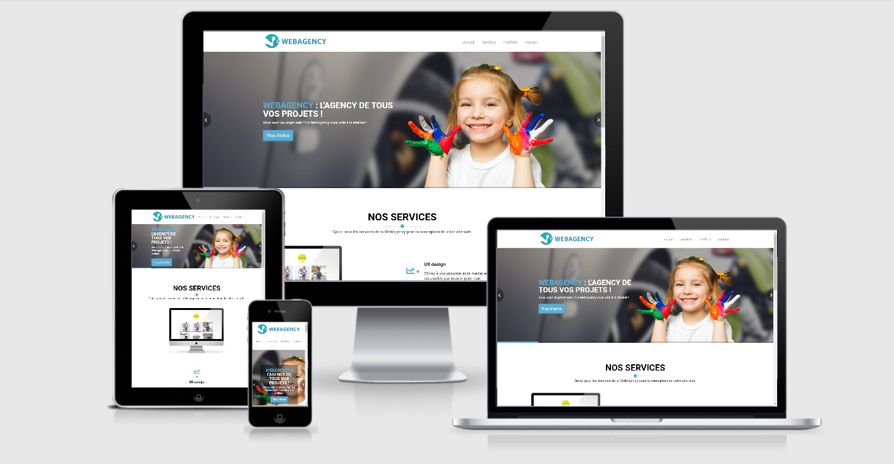

# WebAgency Projet 1 (OpenClassrooms)
> Refonte d'un site web pour une agence à partir d'une maquette en HTML et CSS (sans framework).
> 
>[WebAgency](https://webagency.psamelhori.fr/)

* Le site doit tenir sur une page avec un menu qui reste visible, en haut de la page, même lorsque l'on se déplace dans la page.
* Un premier écran d'accueil de bienvenue, très visuel.
* La liste des services offerts par l'agence.
* Des exemples de projets déjà réalisés.
* Une carte avec un formulaire de contact (juste de l'afficher).

## Screenshots

